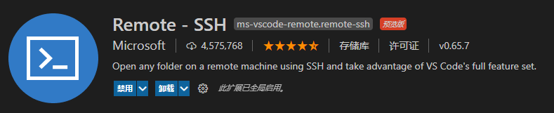
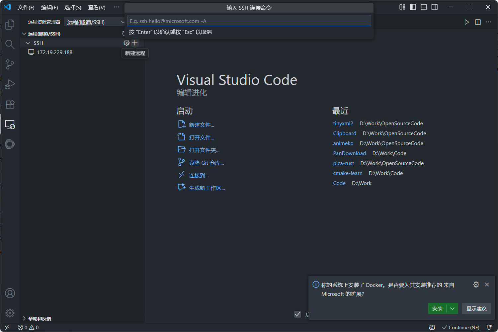
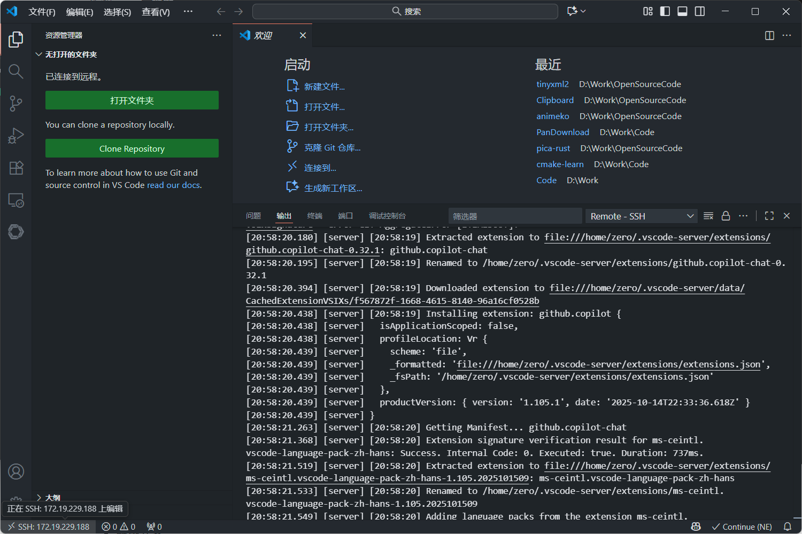

# 使用 VSCode 的RemoteSSH插件连接远程服务器

Visual Studio Code作为由微软开发且跨平台的免费源代码编辑器，默认支持非常多的编程语言，并且本体十分轻量化，在程序员群体中广受欢迎。其中VS code最值得称道的便是它的丰富的插件系统。其中Remote SSH插件允许在任何运行SSH服务器的远程计算机、虚拟机和容器上打开远程文件夹，对于程序员远程开发很有帮。本文将详细讲解如何使用 VS Code 的Remote SSH插件连接接远程服务器，并配置免密登录。

### 一、前提条件

#### 1. 本地环境准备

在开始之前，确保你的本地环境满足以下条件：

1. **Visual Studio Code** 已安装，版本最好是最新稳定版，确保可以支持最新的 Remote-SSH 功能。

2. **SSH 客户端** 已正确安装并配置：

   * **Linux** 和 **Mac** 系统自带 OpenSSH 客户端，一般不需要额外安装。

   * **Windows** 用户需要通过 PowerShell 或 Windows 设置中启用 OpenSSH，或者使用 **Git Bash** 或 **WSL** 提供的 SSH 客户端。可以通过如下命令确认 SSH 是否可用：

     ```
     ssh -V
     ```

     如果未安装，可以通过 Windows 的 **可选功能** 中启用或使用 `choco` 安装：

     ```
     choco install openssh
     ```

#### 2. 远程服务器准备

确保你拥有以下远程服务器的信息：

1. **SSH 访问权限**：

   *   远程服务器支持 SSH 协议。
   *   你有服务器的 **IP 地址**、**用户名** 和 **密码**，或 **SSH 密钥**。

2. **防火墙配置**：

   *   确保服务器的 SSH 端口（通常为 **22**）对你的本地 IP 开放。如果使用自定义端口，需要知道该端口号。

3. **服务器配置**：

   * Linux 系统的服务器通常默认支持 SSH，但一些轻量级发行版可能需要提前安装并启用 OpenSSH 服务器：

     ```
     sudo apt install openssh-server  # Debian/Ubuntu 系列
     sudo systemctl enable ssh
     sudo systemctl start ssh
     ```

### 二、步骤详解

#### 1. 安装 Remote-SSH 插件

打开 VSCode，点击左侧活动栏最下方的 **扩展 (Extensions)** 图标，或者按 `Ctrl+Shift+X` 快捷键调出扩展商店。在搜索栏中输入 “Remote - SSH”，并点击 **安装** 来安装该扩展。



#### 2. 启动 Remote-SSH 连接

插件安装完成后，点击新出现的该图标，然后选择新建远程，选择`Connect to Host`，即 “连接到主机”。然后对话框中输入 SSH 连接命令.



SSH命令格式如下：

```
ssh 用户名@服务器IP地址
```

例如，如果服务器的 IP 地址是 `192.168.0.1`，用户名是 `user`，你需要输入的命令是：

```
ssh user@192.168.0.1
```

如果服务器使用的是自定义端口（如 2200），你需要指定端口：

```
ssh user@192.168.0.1 -p 2200
```


#### 3. 选择 SSH 配置文件位置

输入 SSH 命令后，VSCode 会提示你选择存放 SSH 主机配置信息的文件位置。建议选择默认的 SSH 配置文件，通常是 `~/.ssh/config`。

如果你之前没有配置过，可以直接选择该文件。它会自动生成配置项，方便后续连接。

配置文件 `~/.ssh/config` 的示例如下：

```
Host myserver
    HostName 192.168.0.1
    User user
    Port 2200  # 如果不是默认端口，则手动添加该行
```

*   **Host** 字段是一个别名，方便你后续通过 `ssh myserver` 连接到该服务器。
*   **HostName** 表示远程服务器的 IP 地址或域名。
*   **User** 是登录的用户名。

#### 4. 连接远程主机

添加 SSH 主机后，VSCode 会提示你返回 Remote-SSH 菜单，选择刚刚添加的主机进行连接。点击主机名称后，VSCode 将自动打开一个新窗口并尝试连接到远程服务器。连接服务器后，VSCode 会询问远程服务器的操作系统类型。根据服务器的操作系统（通常是 Linux），选择对应的选项。如果是首次连接该服务器，系统会要求你输入 SSH 密码（或者在使用密钥的情况下，可能需要输入密钥的密码）。输入密码后，按回车即可。当连接成功后，VSCode 左下角会显示远程服务器的名称，表示已经成功连接上远程服务器。



#### 5. 配置免密登录

将本机添加到远程服务器连接白名单，让服务器知道是已认证的电脑在连接，不用每次都输入密码。

1. **生成本机ssh密钥**

​	在本地主机终端执行以下命令生成公私钥对：

​	`ssh-keygen -t rsa -b 4096 -C "your_email@example.com"`

​	按三次回车，默认保存到` ~/.ssh/id_rsa`（私钥）和 `~/.ssh/id_rsa.pub`（公钥）。

​	如果不需要密码短语，直接回车跳过。

2. **上传公钥到远程服务器**

​	推荐使用以下命令自动上传公钥：

​	`ssh-copy-id user@192.168.1.100`

​	输入目标服务器密码完成配置。

​	或者手动复制公钥到服务器上的`~/.ssh/authorized_keys`文件上，一个公钥单独成一行。

3. **测试免密登录**

​	输入`ssh <user>@<host-ip>`测试是否需要输入密码，若无需输入密码则配置成功。

### 三、常见问题及解决方案

#### 1. SSH 连接失败或超时

* **可能原因**：

  *   防火墙阻止了 SSH 端口（默认 22）的访问。
  *   SSH 服务未在服务器上启动。
  *   使用了错误的 IP 地址或用户名。

* **解决方案**：

  * 检查服务器的 SSH 端口是否开放，可以使用以下命令测试：

    ```
    telnet 192.168.0.1 22
    ```

  * 确保服务器上运行了 SSH 服务：

    ```
    sudo systemctl status ssh
    ```

  * 确认 SSH 账号信息是否正确，确保公钥和私钥对匹配。

#### 2. 密钥认证失败

* **可能原因**：密钥权限不正确，或公钥未正确添加到远程服务器的 `~/.ssh/authorized_keys` 文件中。

* **解决方案**：

  * 确保私钥文件的权限为 600：

    ```
    chmod 600 ~/.ssh/id_rsa
    ```

  * 确保公钥正确地添加到了远程服务器的 `~/.ssh/authorized_keys` 中，并且权限设置为 600。

#### 3. 远程文件过大导致操作缓慢

*   **可能原因**：如果你在编辑非常大的文件，或者远程服务器网络带宽较低，操作可能会变慢。

*   **解决方案**：在 VSCode 中，可以设置 **文件大小警告阈值**，并使用压缩文件传输等方式优化性能。还可以使用 `rsync` 等工具手动同步大文件。
